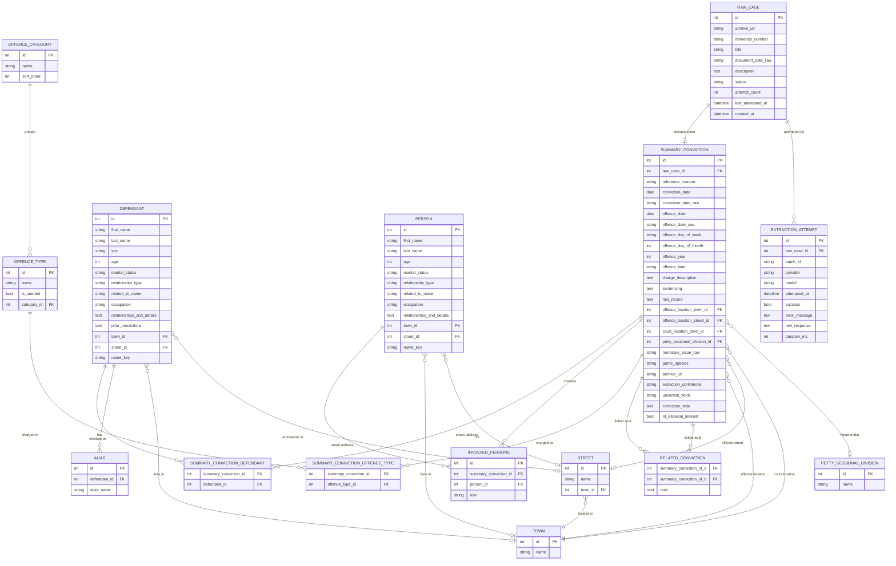

# North Riding Quarter Sessions Database - Entity Relationship Diagram

Reflects the actual v2 schema in `data-loader/qsrecords/models/` (`core.py`,
`reference.py`, `raw.py`) — regenerated 2026-07 after the taxonomy migration.
This file is documentation only; the SQLModel classes are the source of
truth if the two ever disagree.

## Entity descriptions

### RAW_CASE / EXTRACTION_ATTEMPT
Staging table plus audit trail for the LLM extraction pipeline
(`data-loader/qsrecords/models/raw.py`). One `RAW_CASE` row per scraped
Summary Conviction record before extraction; each attempt to turn it into a
`SUMMARY_CONVICTION` row (success or failure, whichever provider/model) is
logged as an `EXTRACTION_ATTEMPT`. `RAW_CASE.status` drives resumability —
`pending` → `done`/`failed`, retried up to a max attempt count. Not part of
v1's file-based staging; see the module docstring.

### SUMMARY_CONVICTION
Primary entity: one row per extracted Summary Conviction record. Carries
both the clean, parsed fields (`offence_date`, `offence_year`, ...) and the
raw/audit fields alongside them (`*_raw` columns, `extraction_confidence`,
`uncertain_fields`, `correction_note`, `of_especial_interest`) — see
`qsrecords/models/core.py` for exactly which fields are LLM-derived vs.
Python-derived.

### DEFENDANT / PERSON
One row per *mention*, not per real person — the same individual appearing
in two cases produces two rows (see About page, "Defendants and involved
persons are not deduplicated"). `DEFENDANT` is the person(s) actually
convicted; `PERSON` is anyone else named (witness, victim, prosecutor,
informant) via the `role` column on `INVOLVED_PERSONS`. `name_key` is a
normalized "first last" retrieval key, not a merge/dedup key.

### OFFENCE_CATEGORY / OFFENCE_TYPE
Two-level taxonomy added to replace v1's flat, unmerged `offence_type`
vocabulary (91 near-duplicate free-text strings collapsed to 55 canonical
leaves under 17 categories — see
`data-loader/qsrecords/offence_types.py::OFFENCE_TAXONOMY` and the
`/taxonomy` explorer page). `category_id` is nullable: a newly-proposed
offence type sits uncategorised until reviewed.

### SUMMARY_CONVICTION_OFFENCE_TYPE
Many-to-many, not the single FK v1 had — a conviction is almost always one
offence type but occasionally charges two genuinely distinct offences at
once (e.g. "assaulting and resisting a constable").

### RELATED_CONVICTION
Self-referential link between two convictions judged to stem from the same
underlying event (one arrest producing several same-day charges, a mutual
assault charged from both sides, a group incident). Informal — built from
patterns noticed reading records or detected heuristically, not a formal
legal grouping — `note` always explains the basis for the link. Stored once
per pair (`summary_conviction_id_a < summary_conviction_id_b`, enforced by
a CHECK constraint) rather than symmetrically twice.

### TOWN / STREET / PETTY_SESSIONAL_DIVISION
Deduplicated reference vocabularies (get-or-create on a normalized name) —
unlike `DEFENDANT`/`PERSON`, these are small and stable enough for a
normalized-string match to be reliable. `PETTY_SESSIONAL_DIVISION` is the
historic administrative/jurisdictional division a case was heard under,
distinct from the town it was heard *in*.

## Notes

- Superseded parts of the earlier version of this document: single
  `offence_type_id` FK on `SUMMARY_CONVICTION` (replaced by the junction
  table above), no `OFFENCE_CATEGORY`, no `RELATED_CONVICTION`, no
  `RAW_CASE`/`EXTRACTION_ATTEMPT` staging, no `PETTY_SESSIONAL_DIVISION`,
  and several `DEFENDANT`/`PERSON`/`SUMMARY_CONVICTION` fields that didn't
  exist yet.
- Six fields (`petty_sessional_division_id`, `monetary_value_raw`,
  `game_species`, and age/marital_status/relationship_type on
  `DEFENDANT`/`PERSON`) were added partway through extraction; see the
  About page's "Two different extraction paths" section for how earlier
  records were backfilled.
- `RAW_CASE`/`EXTRACTION_ATTEMPT` and `RELATED_CONVICTION` are the two
  entities this document previously flagged as "future" — both exist now.
