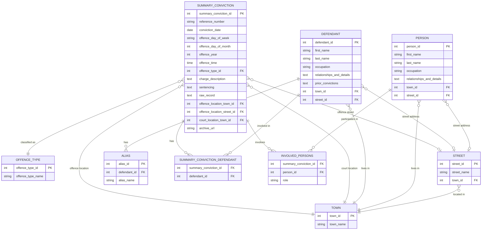

# Historical Court Records Database - Entity Relationship Diagram

This ERD represents the database schema for historical court records, focusing on Summary Convictions with supporting entities for defendants, persons, locations, and offence types.

## Entity Descriptions

### SUMMARY_CONVICTION
Primary entity representing individual court cases with summary convictions for petty offences.

### DEFENDANT
Individuals who are defendants in court cases, with support for aliases and address tracking.

### PERSON
Other individuals involved in cases (prosecutors, informants, property owners, witnesses).

### OFFENCE_TYPE
Standardized classification of offence types (vagrancy, assault, theft, etc.).

### TOWN & STREET
Location entities for tracking addresses and case locations.

### Junction Tables
- **SUMMARY_CONVICTION_DEFENDANT**: Handles multiple defendants per case
- **INVOLVED_PERSONS**: Links other persons to cases with their roles

## Notes
- Future entities (RECOGNIZANCE, INDICTMENT) to be added later
- Offence dates are decomposed into separate fields for analysis
- Raw historical records preserved in `raw_record` field